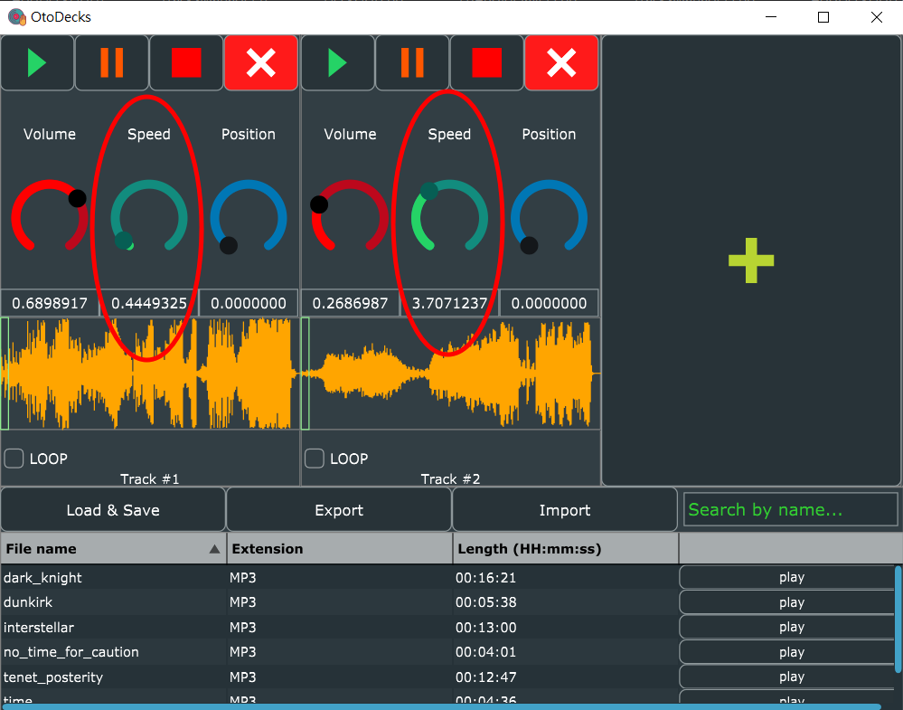

<h1 align="center">
  <a href="#"></a>
  <br>
  Object-Oriented Programming
  <br>
  Coursework for Endterm
  <br>
  Otodecks
  <br>
  Report
  <br>
</h1>

Written & Developed by [Zach, Siu Him CHAN](https://www.linkedin.com/in/zach-chan-hk/)
(SN : **190340436**)

## Table of Contents

<!-- toc -->

- [Table of Contents](#table-of-contents)
- [Introduction](#introduction)
  - [What is OtoDecks?](#what-is-otodecks)
  - [Video Tutorial](#video-tutorial)
  - [How to build OtoDecks](#how-to-build-otodecks)
  - [How to run OtoDecks](#how-to-run-otodecks)
  - [App Interface](#app-interface)
  - [Custom Components Hierarchy](#custom-components-hierarchy)
- [List of Requirements](#list-of-requirements)
  - [**R1: Basic Functionalities**](#r1-basic-functionalities)
    - [**R1A**](#r1a)
    - [**R1B**](#r1b)
    - [**R1C**](#r1c)
    - [**R1D**](#r1d)
  - [**R2: Implementation of a custom deck control Component with custom graphics which allows the user to control deck playback in some way that is more advanced than stop/ start.**](#r2-implementation-of-a-custom-deck-control-component-with-custom-graphics-which-allows-the-user-to-control-deck-playback-in-some-way-that-is-more-advanced-than-stop-start)
    - [**R2A**](#r2a)
    - [**R2B**](#r2b)
  - [**R3: Implementation of a music library component which allows the user to manage their music library**](#r3-implementation-of-a-music-library-component-which-allows-the-user-to-manage-their-music-library)
    - [**R3A**](#r3a)
    - [**R3B**](#r3b)
    - [**R3C**](#r3c)
    - [**R3D**](#r3d)
    - [**R3E**](#r3e)
  - [**R4: Implementation of a complete custom GUI**](#r4-implementation-of-a-complete-custom-gui)
    - [**R4A**](#r4a)
    - [**R4B**](#r4b)
    - [**R4C**](#r4c)

<!-- tocstop -->

## Introduction

### What is OtoDecks?

OtoDecks is a DJ application for DJs to mix their music using multiple tracks. Besides basic functionalities like loading audio files into audio players, playing multiple tracks, mixing the tracks by varying each of their volumes, and speeding up or slowing down the tracks, the application has an advanced deck control and a useful music library component. 

The music library component allows users to manage a library of music within the application. Users can search the music library and load music from it into the decks. It also persists between application loads, by storing the state of the music library in a data file. Users are also able to import and export any extra data files, so they can store and load different playlists.

### Video Tutorial
Link: YT

### How to build OtoDecks
1. 

### How to run OtoDecks
1. Goto Release folder
2. Run Otodecks.exe
3. Welcome alert box shows up. Click "OK" to continue.<br>
   
4. Main app window shows up.<br>
   


### App Interface


### Custom Components Hierarchy
```plain
MainComponent
├── TracksManager (upper half)
│   ├── Track (array)
│   │   ├── DeckGUI
│   │   │   ├── WaveFormDisplay
│   │   │   └── OtherLookAndFeel
│   │   └── DJAudioPlayer
│   └── AddDeckGUI
└── MusicLibrary (lower half)
    └── PlaylistComponent
```


## List of Requirements

### [**R1: Basic Functionalities**]()
#### **R1A**
*R1A: Can load audio files into audio players*

I have moved this functionality to become part of PlaylistCompent.
When the user clicks `Load & Save` button, it opens up a file dialog to ask for audio files. Then it will be loaded, stored as a playlist item and displayed on the playlist table.
Loading them into audio players will be triggered by clicking the corresponding `play` button.

After clicking the `play` button, an AlertWindow will pop up and ask the user which available track to load the playlist item into. (Hint: If no tracks available, you have to add the tracks by clicking the `+` button in AddDeckGUI.)

Steps to load audio files are shown on the below screenshot:<br/>


The click event of the play button is handled by `PlaylistComponent::buttonClicked` function inside `PlaylistComponent.cpp`. Its duty is to validate and pass the loading job to the selected track.

After serveral validation, the event handler will call `track->deckGUI.loadURL(filePath)` to call the selected track's loadURL function in its deckGUI. The implementation is inside `DeckGUI::loadURL` in `DeckGUI.cpp`:
```C++
bool DeckGUI::loadURL(URL& fileURL)
{
    bool sucessLoading = player->loadURL(fileURL);
    if (sucessLoading) {
        reset();
        waveformDisplay.loadURL(fileURL);
        player->readerSource->setLooping(loopButton.getToggleStateValue() == 1); // set looping on AudioFormatReaderSource
        return true;
    }
    return false;
}
```
As you can see, this function loads the fileURL to the player by calling `player->loadURL(fileURL)` function, which is implemented in `DJAudioPlayer::loadURL`. Once it is successful, the waveform display will also load the waveform graphics using the audio file URL by calling `waveformDisplay.loadURL(fileURL)`. Looping will then be set based on the state of the `Loop` checkbox below the waveform display.

To go even deeper, `DJAudioPlayer::loadURL` will also read the file using `AudioFormatManager` and set the audio source using `AudioFormatReaderSource`. I believe this part has already been covered in the lectures.

#### **R1B**
*R1B: Can play two or more tracks*

TracksManager handles this part. It stores an array of tracks with maximum of 5 tracks (can be changed using TRACKS_LIMIT const). Users can add tracks by clicking the `+` button from the AddDeckGUI.<br/>


The addTrackButton is a button in AddDeckGUI class, but its listener is registered in TracksManager, using the following statement:
```C++
addDeck.addTrackButton.addListener(this);
```
And its click event handler is implemented in `TracksManager::buttonClicked` using `TracksManager::addTrack` in `TracksManager.cpp`:
```C++
void TracksManager::buttonClicked(Button* button)
{
    if (button == &(addDeck.addTrackButton)) {
        addTrack();
    }
    ...
}
void TracksManager::addTrack()
{
    for (auto& track : tracks) {
        if (!track->deckGUI.isVisible()) {
            track->deckGUI.setVisible(true);
            break;
        }
    }
    resized();
}
```

Once we have 2 or more different tracks, we can click `play` in the Music Library to choose on which track the user would like to load the audio. This part is already covered in [R1A](#r1a). Since the tracks are independent, they have two different DJAudioPlayer, which means two independent `AudioTransportSource`. So to allow the tracks to be mixed, `TracksManager` also includes a `MixerAudioSource` which allows 2 or more tracks to be played simultaneously, using the following implementation in `TracksManager::prepareToPlay` function and other overridding functions:
```C++
void TracksManager::prepareToPlay(int samplesPerBlockExpected, double sampleRate)
{
    mixerSource.prepareToPlay(
        samplesPerBlockExpected,
        sampleRate
    );

    for (auto& track : tracks) {
        track->prepareToPlay(
            samplesPerBlockExpected,
            sampleRate
        );
        mixerSource.addInputSource(&track->player, false);
    }
}
void TracksManager::getNextAudioBlock(const AudioSourceChannelInfo& bufferToFill)
{
    mixerSource.getNextAudioBlock(bufferToFill);
}
void TracksManager::releaseResources()
{
    for (auto& track : tracks) {
        track->releaseResources();
    }

    mixerSource.releaseResources();
}
```
`mixerSource.addInputSource` allows to append AudioSource to the mixing list, allowing the audio mixing. This makes the application able to play two or more tracks.

#### **R1C**
*R1C: Can mix the tracks by varying each of their volumes*

On each track, the GUI has a circular slider to control its volume.<br/>


The value under the slider shows the current volume of the track. Users can either slide the slider or input the value in the field to change the volume. Maximum volume is 1 while silence is volume = 0.

Volume slider is a juce:Slider component declared in Track's DeckGUI.

Volume slider is a juce:Slider component declared in Track's DeckGUI. When the slider value is changed, `DeckGUI::sliderValueChanged` function responds to the change as the slider registers DeckGUI as its event listener using the following statement in DeckGUI's constructor:
```C++
volSlider.addListener(this);
```
When the slider changes, the slide event handler set the gain of its DJAudioPlayer to the volume slider's value using the following statement:
```C++
void DeckGUI::sliderValueChanged(Slider* slider) {
    if (slider == &volSlider) {
        player->setGain(slider->getValue());
    }
    ...
}
```
In this way, users can control the volume of each track using each of the volume sliders.

#### **R1D**
*R1D: Can speed up and slow down the tracks*

On each track, the GUI has a circular slider to control its audio speed.<br/>


The value under the slider shows the current speed multipler of the track. Users can either slide the slider or input in the field to change the speed. Maximum speed is set to be 10 times faster than normal, while normal speed is 1 and a stop is at speed = 0.

Speed slider is a juce:Slider component declared in Track's DeckGUI. When the slider value is changed, `DeckGUI::sliderValueChanged` function responds to the change as the slider has register DeckGUI as its event listener using the following statement in DeckGUI's constructor:
```C++
speedSlider.addListener(this);
```
When the slider changes, the slide event handler set the speed of its DJAudioPlayer to the speed slider's value using the following statement:
```C++
void DeckGUI::sliderValueChanged(Slider* slider) {
    ...
    if (slider == &speedSlider) {
        player->setSpeed(slider->getValue());
    }
    ...
}
```
In this way, users can control the speed of each track using each of the speed sliders.


### [**R2: Implementation of a custom deck control Component with custom graphics which allows the user to control deck playback in some way that is more advanced than stop/ start.**]()
#### **R2A**
*R2A: Component has custom graphics implemented in a paint function*

My custom graphics are implemented on a few buttons: Play button, Pause button, Stop button, Close Track Button on the Track GUI, Add Track Button on AddDeckGUI. Those icons on the buttons are all drawn using their own paint functions. The following screenshot shows the buttons I am talking about:<br/>


For example, let's look at how I draw the Play button in the constructor of DeckGUI:
```C++
{
    /** Use Path to create a triangle **/
    Path p;
    // 3 Points (x, y) offsets from center of the button
    p.addTriangle({ -5, -8 }, { -5, 8 }, { 5, 0 });
    playPath.setPath(p);
    playPath.setFill(Colour(37, 211, 102)); // set the path fill to green
}
playButton.setImages(&playPath, nullptr, nullptr); // set the button's image as the path
playButton.setTooltip(playButton.getButtonText());
```


#### **R2B**
*R2B: Component enables the user to control the playback of a deck somehow*

I added a loop checkbox component at the bottom of the Track GUI. More advanced than stop/start, when the user ticks the loop checkbox, once the audio playback has reached the end, it goes back to the beginning, creating an endless looping until the user unchecks the box. Screenshot below shows the position of the checkbox:<br />


In the implementation, the loop checkbox is a `juce::ToggleButton`, so its event handler is `DeckGUI::buttonClicked`. The following snippet shows when the loop button is toogle what will be performed:
```C++
void DeckGUI::buttonClicked(Button* button) {
    ...
    if (button == &loopButton) {
        if (player->readerSource != nullptr) {
            // set looping on AudioFormatReaderSource
            player->readerSource->setLooping(loopButton.getToggleStateValue() == 1);
        }
    }
}
```

By setting the looping state of the `juce::AudioFormatReaderSource` using the loop button toggle state, the player is able to know when the user wants to endless loop the audio playback.

### [**R3: Implementation of a music library component which allows the user to manage their music library**]()
#### **R3A**
*R3A: Component allows the user to add files to their library*

Users can add audio files by clicking `Load & Save` button in the Music Library. The button is a TextButton called loadSaveButton declared in MusicLibrary Component Class, which is also where its click event listener registered at. So at `MusicLibrary::buttonClicked` in `MusicLibrary.cpp`, we are able to see what the button does after clicking the `Load & Save` button:
```C++
void MusicLibrary::buttonClicked(Button* button)
{
    if (button == &loadSaveButton)
    {
        DBG("MusicLibrary::buttonClicked Load & Save Button was clicked.");

        // Load
        bool loaded = false;
        FileChooser chooser{ "Select file(s)..." };
        do {
            if (chooser.browseForMultipleFilesToOpen()) // will return true if user choose >= 1 files
            {
                for (auto& chooserRes : chooser.getResults())
                {
                    File* file = new File(chooserRes);
                    if (playlistComponent.pushFileToPlaylist(file)) {
                        // success
                        playlistComponent.refresh(); // refresh the list
                        loaded = true;
                    }
                }
            }
            else break; // break the do loop if cancel
        } while (!loaded);

        if (loaded) {
            saveToTempFile();
        }
    }
    ...
}
```
It then opens up a file dialog to ask for audio files. The above snippet reveals that the user can add multiple files to the file dialog since it `browseForMultipleFilesToOpen()`. The `loaded` boolean is only true when playlistComponent successfully push at least one of the files the user submitted in the dialog. And `PlaylistComponent::pushFileToPlaylist` will only return true if the file is valid with recognised audio format, if the file exists, and if the file is not already on the platlist.
```C++
bool validFile = false;
for (auto& knownFormat : knownFormats) {
    if (knownFormat->canHandleFile(*file)) {
        validFile = true;
        break;
    }
}
bool existFile = file->exists();
bool onListFile = isFileOnList(file);
if (validFile && existFile && !onListFile) {
    ...
    return true;
}
```

`saveToTempFile` will then call `PlaylistComponent::writeToFile` which will append the .data file with the full file path, using `std::ofstream` fileWriter.

As you can see, the valid audio files will be loaded, stored as a playlist item and displayed on the playlist table. Besides loading, the file path will be automatically appended into `OtoDecks.data` file, which is in the same directory with `OtoDecks.exe`. The file is useful to achive requirement [R3E](#r3e).

After successful loading to music library and saving to data file, an alert box will pop up to indicate that the user successfully added files to their library. Screenshot:<br/>


#### **R3B**
*R3B: Component parses and displays meta data such as filename and song length*

When the user add audio files into the library, the table inside it will parse the file and add a new row displaying its filename, file extension, audio length and a play button, as shown below:<br/>


While the program is adding audio file to the music library, `PlaylistComponent::pushFileToPlaylist` (mentioned in [R3A](#r3a)) pushes valid audio file to `PlaylistComponent::trackFiles` std::vector array. Then it will call `PlaylistComponent::tableComponent`'s updateContent() function.
```C++
if (validFile && existFile && !onListFile) {
    trackFiles.push_back(file);
    tableComponent.updateContent();
    ...
}
```

`PlaylistComponent::updateContent()` will trigger `PlaylistComponent::paintCell()` function. I have implemented to override this virtual function. This is where the component parses and displays meta data such as filename and song length.
```C++
if (rowNumber < getNumRows()) {
    if (columnId == 1) { // file name Column
        g.drawText(filesVector[rowNumber]->getFileNameWithoutExtension(),
            2, 0, width - 4, height,
            Justification::centredLeft, true);
    }
    if (columnId == 2) { // extension Column
        std::string extension = filesVector[rowNumber]->getFileExtension().toUpperCase().toStdString();
        extension.erase(std::remove(extension.begin(), extension.end(), '.'), extension.end());
        g.drawText(extension,
            2, 0, width - 4, height,
            Justification::centredLeft, true);
    }
    if (columnId == 3) { // audio file length Column
        double durationInSec = getAudioFileDuration(filesVector[rowNumber], &(tracksManager->formatManager));
        time_t seconds(durationInSec); // you have to convert your input_seconds into time_t
        tm* p = gmtime(&seconds); // convert to broken down time
        char durationInISO[80];
        strftime(durationInISO, 80, "%H:%M:%S", p); // convert seconds to ISO8601
        g.drawText(durationInISO,
            2, 0, width - 4, height,
            Justification::centredLeft, true);
    }
}
```
Below is the implementation to get the audio file duration in seconds:
```C++
double PlaylistComponent::getAudioFileDuration(File* file, AudioFormatManager* fm)
{
    auto* reader = fm->createReaderFor(&(FileInputStream(*file)));
    return reader->lengthInSamples / reader->sampleRate;
}
```

#### **R3C**
*R3C: Component allows the user to search for files*

In MusicLibrary, there is a textbox with placerholder "Search by name...". Users are able to input in the field to serach for files in the table. The table will be filtered by name with the search text. Below screenshot shows the search bar in action:<br/>


This search box is a `juce::TextEditor` named searchTextbox inside MusicLibrary Component, and it is passed into its PlaylistComponent using pointers in the constructor. The text change event handler is `MusicLibrary::textEditorTextChanged` function.
```C++
void MusicLibrary::textEditorTextChanged(TextEditor& textEditor)
{
    if (&textEditor == &searchTextbox) {
        // Get search bar's text
        String searchText = textEditor.getText();

        DBG("MusicLibrary::textEditorTextChanged, Value: " + searchText);
        playlistComponent.searchResults.clear(); // clear previous searchResults

        if (searchText.isNotEmpty()) {
            for (auto& trackFile : playlistComponent.trackFiles)
            {
                if (trackFile->getFileName().trim().toLowerCase().contains(searchText.trim().toLowerCase())) { // found a match
                    playlistComponent.searchResults.push_back(trackFile);
                }
            }
        }

        playlistComponent.refresh(false);
    }
}
```
As you can see in the code, PlaylistComponent's searchResults `std:vector` is responsible to store the search file results that matches search text. To show the search results, playlistComponent refreshes its table. Thus it calls `PlaylistComponent::paintCell` function. Inside this function, it will determine whether to show all files or the search results using the following statements:
```C++
std::vector<File*> filesVector = trackFiles;
if (searchTextbox->getText().isNotEmpty()) { // if there's a search
    filesVector = searchResults;
}
```
It determines by using the fact that whether search textbox is empty or not. Then the part to draw the table contents is exactly the same as the part we have shown in [R3B](#r3b).

#### **R3D**
*R3D: Component allows the user to load files from the library into a deck*

I have mentioned similar process in [R1A](#r1a) about loading files into audio players.

With audio files list item in the MusicLibrary, we can click `play` button of that song item. After clicking the button, an AlertWindow will pop up and ask the user which available track to load the playlist item into. (Hint: If no tracks available, you have to add the tracks by clicking the `+` button in AddDeckGUI.)

Steps to load audio files are shown on the below screenshot:<br/>


The click event of the play button is handled by `PlaylistComponent::buttonClicked` function inside `PlaylistComponent.cpp`. Its duty is to validate and pass the loading job to the selected track.

After serveral validation, the event handler will call `track->deckGUI.loadURL(filePath)` to call the selected track's loadURL function in its deckGUI. The implementation is inside `DeckGUI::loadURL` in `DeckGUI.cpp`:
```C++
bool DeckGUI::loadURL(URL& fileURL)
{
    bool sucessLoading = player->loadURL(fileURL);
    if (sucessLoading) {
        reset();
        waveformDisplay.loadURL(fileURL);
        player->readerSource->setLooping(loopButton.getToggleStateValue() == 1); // set looping on AudioFormatReaderSource
        return true;
    }
    return false;
}
```
As you can see, this function loads the fileURL to the player by calling `player->loadURL(fileURL)` function, which is implemented in `DJAudioPlayer::loadURL`. Once it is successful, the waveform display will also load the waveform graphics using the audio file URL by calling `waveformDisplay.loadURL(fileURL)`.

Therefore, in this way, `PlaylistComponent` allows the user to load files from the library into a deck.

#### **R3E**
*R3E: The music library persists so that it is restored when the user exits then restarts the
application*

As mentioned in [R3A](#r3a), when `MusicLibrary::buttonClicked` handles click event of the `Load & Save` button, `MusicLibrary::saveToTempFile()` will be called. This function is responsible to append the full file path of the added audio file to the `Otodecks.data` file, using `std::ofstream` fileWriter. Please be noted that the default data file is located in the same directory as the app .exe locates. The following shows the coding for `MusicLibrary::saveToTempFile()`:
```C++
void MusicLibrary::saveToTempFile()
{
     playlistComponent.saveToTempFile();
}
```
It passes the job to PlaylistComponent, let's see the coding for that part:
```C++
void PlaylistComponent::saveToTempFile(bool notificationOn)
{
    // Save
    File* fileToSaveTo = new File(TEMP_FILENAME + TEMP_FILEEXT);
    if (writeToFile(fileToSaveTo)) {
        if (notificationOn) {
            AlertWindow::showMessageBox(AlertWindow::InfoIcon, ProjectInfo::projectName,
                "Load success and saved Playlist to " + TEMP_FILENAME + TEMP_FILEEXT);
        }
    }
    else {
        if (notificationOn) {
            AlertWindow::showMessageBox(AlertWindow::WarningIcon, ProjectInfo::projectName,
                "Error while saving Playlist to " + TEMP_FILENAME + TEMP_FILEEXT);
        }
    }
    delete fileToSaveTo; // release memory
}
```
The function uses a pointer to File to store the File. The url is constructed with 2 constants: `TEMP_FILENAME` and `TEMP_FILEEXT`. And the constants definitions can be found at the top of the cpp file:
```C++
const String PlaylistComponent::TEMP_FILENAME = String(ProjectInfo::projectName);
const String PlaylistComponent::TEMP_FILEEXT = ".data";
```
In this way, the application will store the file url automatically to `Otodecks.data`.

When the user exits and restart the application, the application will read its `Otodecks.data` in the same directory and try to restore all the files listed in the data file. However, if the audio file is already moved or deleted from the system such that the application cannot locate them using the url stored, the application will skip adding the file and pop up an alert box informing the user the audio file does not exists anymore. 
The following coding shows details in action:

When the app starts, MusicLibrary's constructor is called, which calls its `loadFromTempFile();`:
```C++
MusicLibrary::MusicLibrary(TracksManager* tm)
    : tracksManager{ tm }
{
    // init load temp file to the playlist
    loadFromTempFile();
    ...
}
void MusicLibrary::loadFromTempFile()
{
    playlistComponent.loadFromTempFile();
}
```
So the function passes the job to PlaylistComponent to load audio files into the library using its vector array `trackFiles`:
```C++
void PlaylistComponent::loadFromTempFile()
{
    // Read
    File* fileToRead = new File(TEMP_FILENAME + TEMP_FILEEXT);
    if (readFromFile(fileToRead)) {
        if (fileToRead->exists()) {
            AlertWindow::showMessageBox(AlertWindow::InfoIcon, ProjectInfo::projectName,
                "Restored Playlist from " + TEMP_FILENAME + TEMP_FILEEXT);
            saveToTempFile(false); // save to remove non-existing paths in the temp file
        }
    }
    else {
        AlertWindow::showMessageBox(AlertWindow::InfoIcon, ProjectInfo::projectName,
            "Error while reading Playlist from " + TEMP_FILENAME + TEMP_FILEEXT);
    }
    delete fileToRead; // release memory
}
```
As you can see above, the function reads from the same data file as `saveToTempFile()` saves, and check if the file exists or not. Then `saveToTempFile()` is called only on successful loading to remove any non-existing paths in the data file.

Therefore, the music library persists so that it is restored when the user exits then restarts the
application.

### [**R4: Implementation of a complete custom GUI**]()
#### **R4A**
*R4A: GUI layout is significantly different from the basic DeckGUI shown in class, with
extra controls*

Below shows the basic DeckGUI shown in class:


And below shows my application GUI:


Under this comparison, the GUI layout is significantly different from the basic DeckGUI shown in class, in the following special features:
1. Added Pause and Close Track Button to each DeckGUI.
2. Buttons on the same line instead of different lines.
3. Buttons are colored ImageButtons drawn using Paths, instead of simple TextButtons.
4. Colored Circular Sliders with labels on the same line, instead of horizontal sliders on different lines.
5. Extra checkbox control to set looping to the song.
6. Add/Close Track feature so that users can control how many tracks they want to use or show.
7. Moved the Load Button to the Music Library to load files into library first before loading into the track, instead of inside DeckGUI to directly load files to the track, giving the user more flexibility using the Music Library.

#### **R4B**
*R4B: GUI layout includes the custom Component from R2*


Say for example, the following coding shows how I implemented the GUI of custom Close Track Button:
```C++
class DeckGUI : ... {
    ...
    DrawableButton closeButton{ "CLOSE", DrawableButton::ImageOnButtonBackground };
    ...
}
DeckGUI::DeckGUI(...) {
    ...
    {
        Path p;
        p.addLineSegment(Line<float>(-4, -4, 4, 4), 2);
        p.addLineSegment(Line<float>(4, -4, -4, 4), 2);
        closePath.setPath(p);
        closePath.setFill(Colours::white); // red
    }
    closeButton.setImages(&closePath, nullptr, nullptr);
    closeButton.setTooltip(closeButton.getButtonText());
    closeButton.setColour(TextButton::ColourIds::buttonColourId, Colours::red); // red
    ...
}

void DeckGUI::resized() {
    double rowH = getHeight() / 8;
    double controlsW = getWidth() / 4;
    ...
    closeButton.setBounds(3 * controlsW, 0, controlsW, rowH);
    ...
}
```


As for the checkbox, it's a simple juce::ToogleButton:
```C++
class DeckGUI : ... {
    ...
    ToggleButton loopButton{ "LOOP" };
    ...
}
void DeckGUI::resized() {
    double rowH = getHeight() / 8;
    ...
    loopButton.setBounds(0, rowH * 7, getWidth(), rowH);
    ...
}
```

#### **R4C**
*R4C: GUI layout includes the music library component from R3*


Music Library GUI is implemented using the following coding:
```C++
class MusicLibrary : ... {
    TextButton loadSaveButton{ "Load & Save" };
    TextButton exportButton{ "Export" };
    TextButton importButton{ "Import" };
    TextEditor searchTextbox;
    ...
    PlaylistComponent playlistComponent{ tracksManager, &searchTextbox };
}
MusicLibrary::MusicLibrary(...)
{   
    ...
    searchTextbox.setText("");
    searchTextbox.setTextToShowWhenEmpty("Search by name...", Colours::limegreen);
    ...
}
void MusicLibrary::resized()
{
    double buttonsHeight = getHeight() / 5;
    double buttonsWidth = getWidth() / 4;

    double textboxPadding = buttonsHeight / 8;
    double textboxHeight = buttonsHeight - 2 * textboxPadding;
    double textboxWidth = buttonsWidth - 2 * textboxPadding;

    loadSaveButton.setBounds(0, 0, buttonsWidth, buttonsHeight);
    exportButton.setBounds(buttonsWidth, 0, buttonsWidth, buttonsHeight);
    importButton.setBounds(2 * buttonsWidth, 0, buttonsWidth, buttonsHeight);
    searchTextbox.setBounds(3 * buttonsWidth + textboxPadding, textboxPadding, textboxWidth, textboxHeight);
    searchTextbox.applyFontToAllText(Font(textboxHeight * 0.6f));

    playlistComponent.setBounds(0, buttonsHeight, getWidth(), 4 * buttonsHeight);
}
class PlaylistComponent : ... {
    ...
    TableListBox tableComponent;
    ...
}
PlaylistComponent::PlaylistComponent(...)
{
    // Table Headers
    tableComponent.getHeader().addColumn("File name", 1, 400);
    tableComponent.getHeader().addColumn("Extension", 2, 400);
    tableComponent.getHeader().addColumn("Length (HH:mm:ss)", 3, 400);
    tableComponent.getHeader().addColumn("", 4, 400);

    // give it a border
    tableComponent.setColour(ListBox::outlineColourId, Colours::grey);
    tableComponent.setOutlineThickness(1);

    tableComponent.getHeader().setSortColumnId(1, true); // sort forwards by the Name column
    tableComponent.setMultipleSelectionEnabled(true);

    tableComponent.setModel(this);

    addAndMakeVisible(tableComponent);
}
void PlaylistComponent::resized()
{
    tableComponent.setBounds(0, 0, getWidth(), getHeight());

    for (int i = 1; i <= columnsNum; ++i) {
        tableComponent.getHeader().setColumnWidth(i, getWidth() / columnsNum);
    }
}
```